# Doctor Appointment Booking System 

Developed with Flutter <a href="https://flutter.dev" target="_blank" rel="noreferrer"> </a>

## 📖 Introduction
A cutting-edge smart appointment booking system designed to streamline the process of scheduling doctor's appointments. This innovative mobile application addresses the common challenges faced by patients and users when it comes to booking medical appointments. Say goodbye to the hassle of coordinating with receptionists or doctors to secure a suitable appointment slot. Our app simplifies the entire process, allowing users to effortlessly browse available booking slots, and easily select their preferred date and time. Say hello to a more efficient and user-friendly way of managing your healthcare appointments.

## 👥 The Team

We are a team of six 


[](https://github.com/najemhamo)

[](https://github.com/benjamin-dinkelmann)

[](https://github.com/gaurisingh21)

[](https://github.com/KishFalk)

[](https://github.com/CaptainQwertz)

[](https://github.com/enoch-aik)


## 📱 Features:
- ### Patient
- [x] Authentication
- [x] View Doctor's Profile
- [x] Book Appointment with a Doctor
- [x] Add appointment to Calendar
- [x] Push Notifications
- [x] Cancel Appointment
- [x] Calendar schedule view


- ### Doctor
- [x] Authentication
- [x] View upcoming appointments
- [x] Cancel appointment
- [x] Push Notifications
- [x] Cancel Appointment
- [x] Calendar schedule view

## 📸 Screenshots

### Light

| 1                                                                             | 2                                                                             | 3                                                                             |
|-------------------------------------------------------------------------------|-------------------------------------------------------------------------------|-------------------------------------------------------------------------------|
| 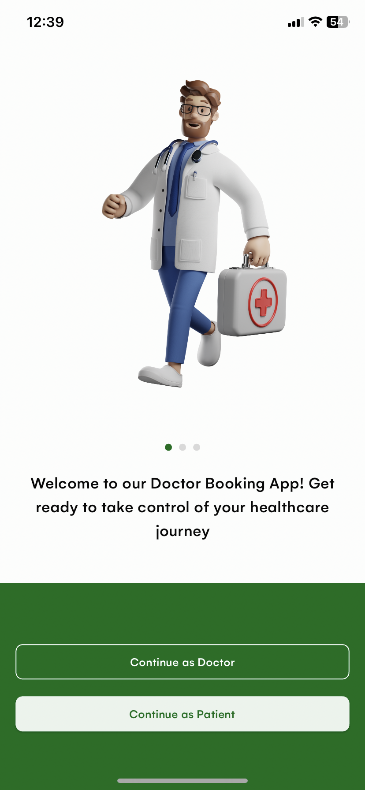 | 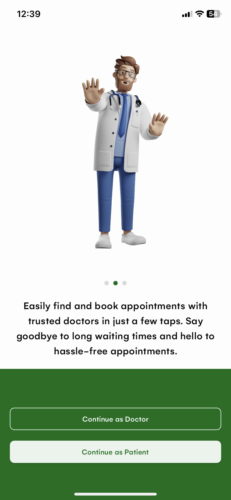 | 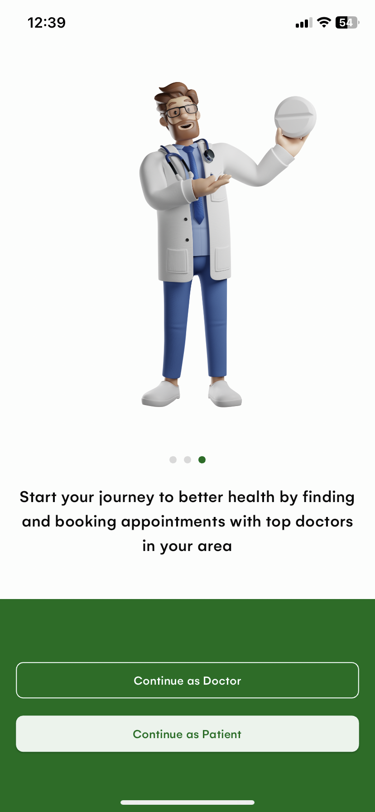 |

| 4                                                                             | 5                                                                             | 6                                                                              |
|-------------------------------------------------------------------------------|-------------------------------------------------------------------------------|--------------------------------------------------------------------------------|
| 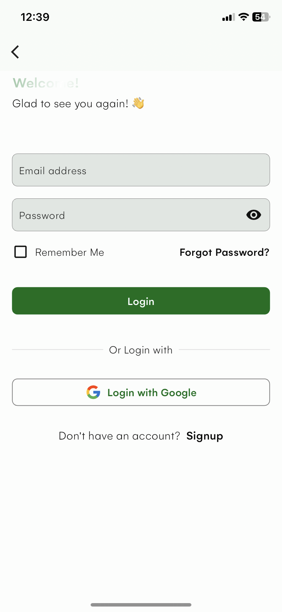 | 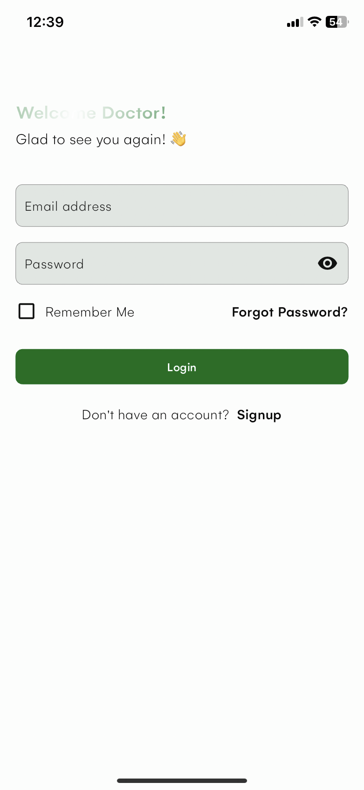 | 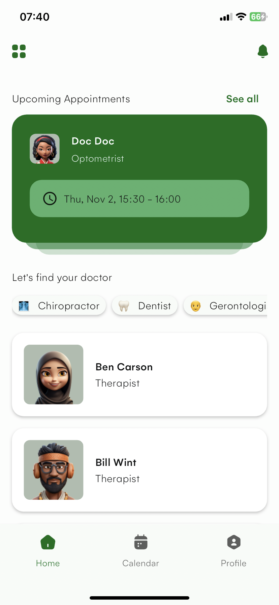 |


| 7                                                                             | 8                                                                             | 9                                                                             |
|-------------------------------------------------------------------------------|-------------------------------------------------------------------------------|-------------------------------------------------------------------------------|
| 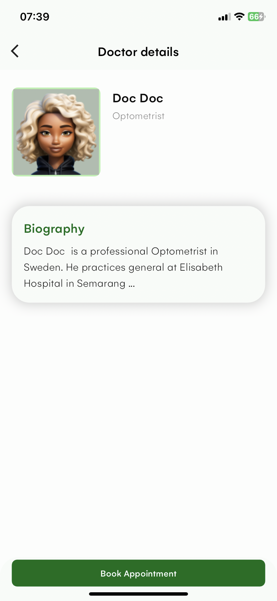 | 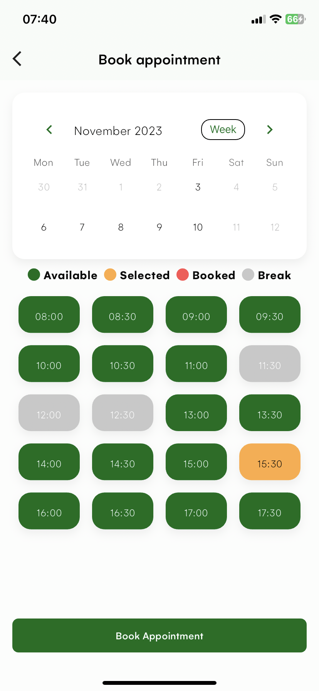 | 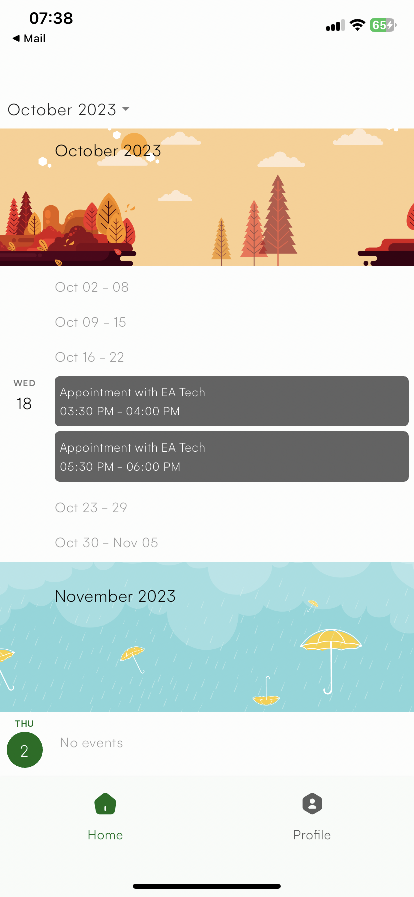 |


| 10                                                                            | 11                                                                             | 12                                                                             |
|-------------------------------------------------------------------------------|--------------------------------------------------------------------------------|--------------------------------------------------------------------------------|
| 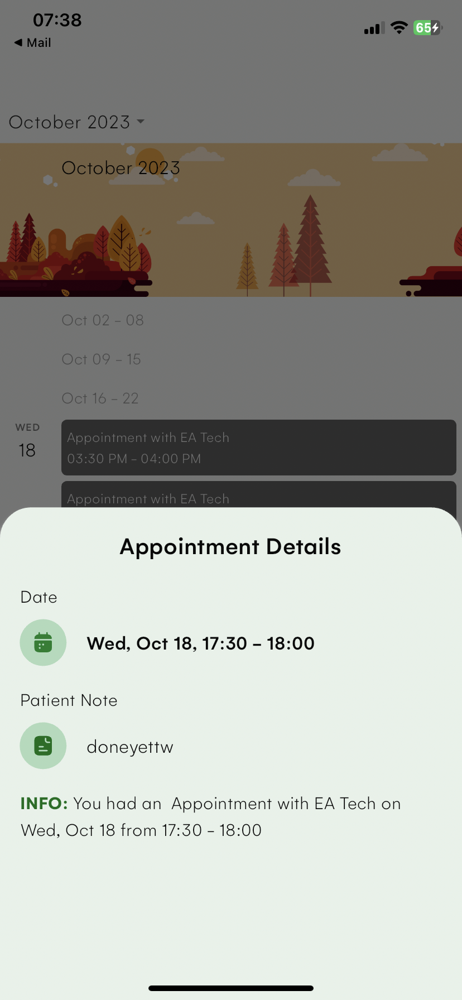 | 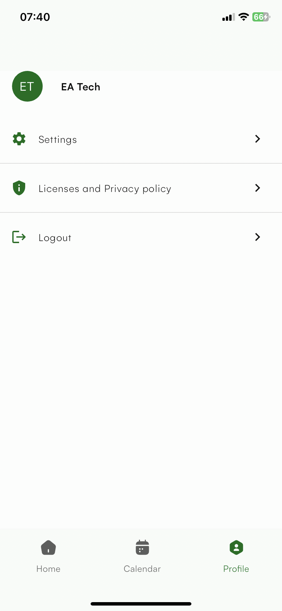 | 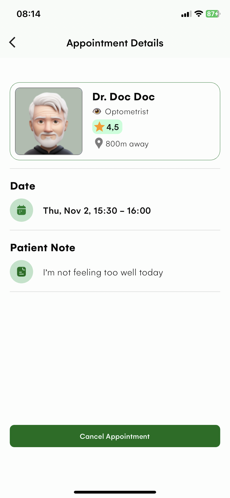 |


### Dark

| 1                                                                            | 2                                                                            | 3                                                                            |
|------------------------------------------------------------------------------|------------------------------------------------------------------------------|------------------------------------------------------------------------------|
| 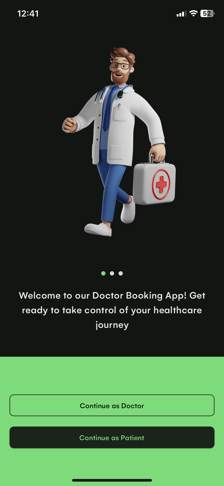 | 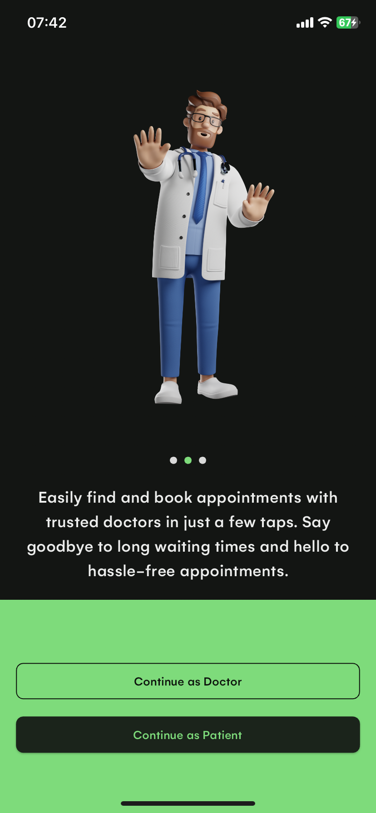 | 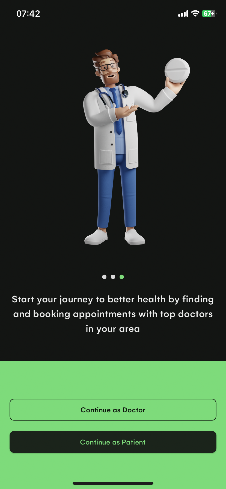 |

| 4                                                                            | 5                                                                            | 6                                                                            |
|------------------------------------------------------------------------------|------------------------------------------------------------------------------|------------------------------------------------------------------------------|
| 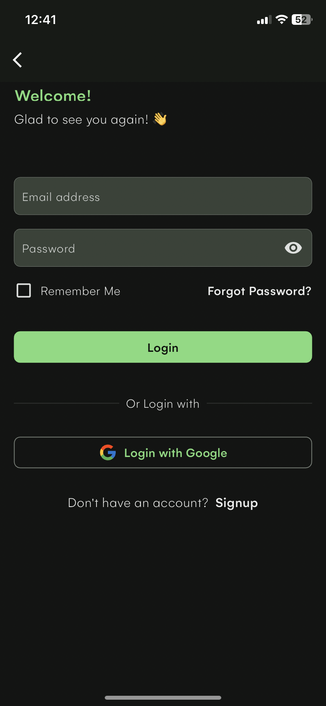 | 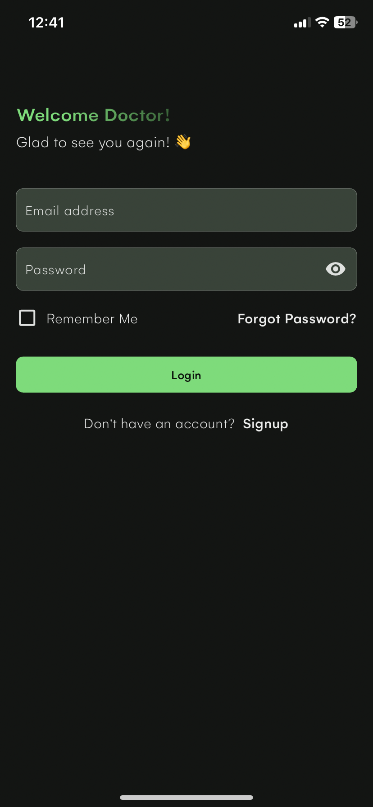 | 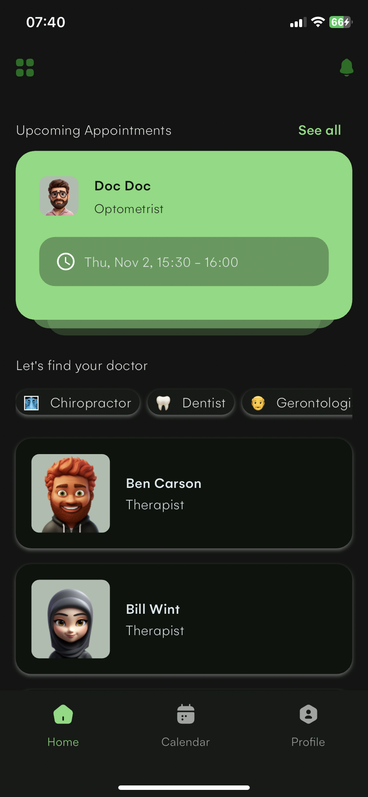 |

## Packages & Libraries Used

* [Flutter SVG](https://github.com/dnfield/flutter_svg) (SVG)
* [Flutter ScreenUtil](https://github.com/OpenFlutter/flutter_screenutil) (Responsive UI)
* [Dio](https://github.com/flutterchina/dio) (API calls)
* [Riverpod](https://github.com/rrousselGit/river_pod) (State management)
* [Shared Preferences](https://github.com/flutter/plugins/tree/master/packages/shared_preferences/shared_preferences) (Local Persistence)
* [Json Serialization](https://github.com/dart-lang/json_serializable) (Serialization)
* [Intl](https://github.com/dart-lang/intl) (Localization)
* [Firebase Messaging](https://github.com/firebase/flutterfire/tree/master/packages/firebase_messaging/firebase_messaging) (Messaging and Notification)
* [Firebase Core](https://github.com/firebase/flutterfire/tree/master/packages/) (Messaging and Notification)
* [Firebase Auth](https://github.com/firebase/flutterfire/tree/master/packages/) (Authentication)
* [Firestore](https://github.com/firebase/flutterfire/tree/master/packages/) (Database)
* [Google Sign In](https://github.com/firebase/flutterfire/tree/master/packages/) (Google Authentication)


## Getting Started

This project is a starting point for a Flutter application.

A few resources to get you started if this is your first Flutter project:

- [Lab: Write your first Flutter app](https://docs.flutter.dev/get-started/codelab)
- [Cookbook: Useful Flutter samples](https://docs.flutter.dev/cookbook)

For help getting started with Flutter development, view the
[online documentation](https://docs.flutter.dev/), which offers tutorials,
samples, guidance on mobile development, and a full API reference.

## How to use

**Step 1**

Download or clone this repo by using the link below
```
https://github.com/enoch-aik/doctor_booking
```

**Step 2**

Go to project root and execute the following command in console to get the required dependencies:

```
flutter pub get
```

## Hide Generated Files

In-order to hide generated files, navigate to `Android Studio` -> `Preferences` -> `Editor` -> `File Types` and paste the below lines under `ignore files and folders` section:

